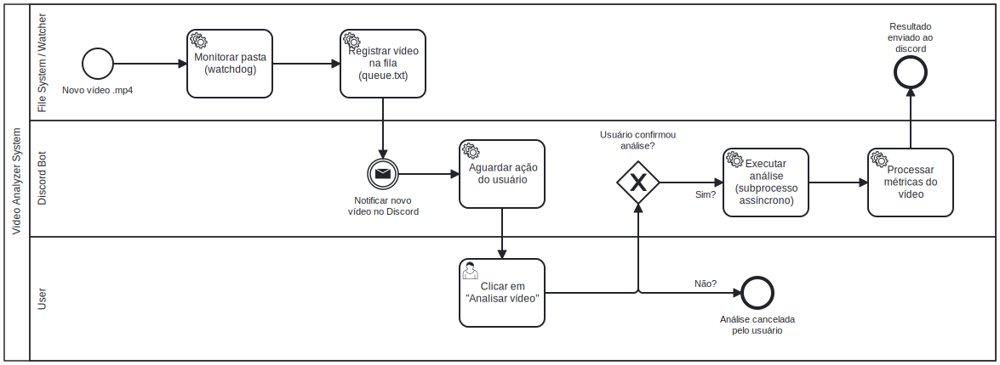

# 📹 Video Analyzer Bot & Watcher

Sistema automatizado para **detecção, enfileiramento e análise técnica de vídeos**, com monitoramento em tempo real de diretórios locais e **interação humana controlada via Discord**.

O projeto foi concebido para analisar vídeos de forma **assíncrona, segura e sob demanda**, evitando processamento automático indesejado e garantindo controle total do fluxo.

---

## 🚀 Funcionalidades

### 🔍 Monitoramento Ativo

* Observação contínua de um diretório local utilizando **Watchdog**
* Detecção imediata de novos arquivos `.mp4`

### 📥 Gestão de Fila Persistente

* Registro dos arquivos detectados em uma **fila persistente baseada em sistema de arquivos**
* Garante integridade e rastreabilidade entre detecção e processamento

### 🤖 Interface Interativa no Discord

* Bot com **botões interativos (`discord.ui.View`)**
* A análise **só é iniciada mediante ação explícita do usuário**, evitando consumo desnecessário de recursos

### ⚡ Processamento Assíncrono

* Execução de análises via `asyncio.create_subprocess_exec`
* O bot permanece responsivo durante o processamento dos vídeos

### 📊 Análise Técnica de Vídeos

* Script dedicado para avaliação de:

  * Clareza
  * Didática
  * Engajamento
  * Qualidade técnica
* Métricas baseadas em **heurísticas computacionais definidas no `analyzer.py`**

---

## 🛠️ Tecnologias Utilizadas

* **Python 3.x**
* **discord.py** – Interface do bot e interação com o usuário
* **Watchdog** – Monitoramento de eventos no sistema de arquivos
* **AsyncIO** – Gerenciamento de tarefas assíncronas e subprocessos

---

## 📂 Estrutura do Projeto

```text
.
├── watcher.py       # Observa a pasta e detecta novos vídeos
├── bot.py           # Núcleo do bot Discord e controle da fila
├── analyzer.py      # Motor de análise dos vídeos
├── config.py        # Configurações, tokens e caminhos
├── queue.txt        # Fila persistente simplificada
└── requirements.txt # Dependências do projeto
```

---

## 🔄 Fluxo do Sistema



1. Um novo vídeo `.mp4` é detectado pelo `watcher.py`
2. O arquivo é registrado na fila persistente (`queue.txt`)
3. O bot notifica o Discord sobre o novo vídeo disponível
4. O usuário decide iniciar a análise através de um botão
5. O `analyzer.py` processa o vídeo de forma assíncrona
6. Os resultados são reportados no Discord

---

## 📝 Notas de Desenvolvimento

Para fins de simplicidade e agilidade, e considerando um ambiente experimental com **baixo volume de arquivos**, a fila foi implementada utilizando o sistema de arquivos (`queue.txt`).

Esta é uma **decisão arquitetural deliberada**, que prioriza:

* Facilidade de execução
* Baixa complexidade operacional
* Ausência de dependências externas

A arquitetura permite evolução futura para:

* Banco de dados
* Message brokers (RabbitMQ, Redis, etc.)
* Orquestração de tarefas

Sem necessidade de grandes refatorações.

---

## ⚙️ Instalação e Uso

### 1️⃣ Instale as dependências

```bash
pip install -r requirements.txt
```

### 2️⃣ Configure o ambiente

Edite o arquivo `config.py` e configure:

* Token do bot do Discord
* ID do canal
* Caminho da pasta monitorada (`WATCH_FOLDER`)

### 3️⃣ Inicie o sistema

Em terminais separados:

```bash
# Terminal 1 - Monitoramento
python watcher.py
```

```bash
# Terminal 2 - Bot Discord
python bot.py
```

---

## 🧠 Considerações Finais

Este projeto foi desenvolvido com foco em **controle de fluxo, concorrência e automação**, priorizando clareza arquitetural e decisões técnicas conscientes.
